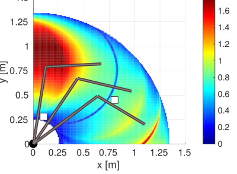

# Constrained Manipulability

Constrained Manipulability is a library used to compute and vizualize a robot's constrained capacities. 

## Features
 - Compute a robot's constrained allowable Cartesian motions due to collision avoidance constraints and joint limits
 - Compute a robot's constrained manipulability polytope due to dangerfield constraints
 - A ROS 2 interface that allows the above quantities to be used in IK optimization algorithms for collision-free trajectory optimization

 Implementations for the following ROS distros are available on different git branches of this repository:
- [ROS 1 Noetic](https://wiki.ros.org/noetic) on the `noetic-devel` branch,
- [ROS 2 Humble](https://docs.ros.org/en/humble/index.html) on the default `master` branch.

The package was developed and tested on Ubuntu 20.04 for Noetic and Ubuntu 22.04 for Humble. Nevertheless, any operating systems supported by the ROS distros available to this package should also work.

We recommend using the default ROS 2 Humble implementation on `master`, as this continues to have ongoing support.

## Installation 

The following instructions will enable you to build the `constrained_manipulability` package within a [ROS 2 workspace](https://docs.ros.org/en/humble/Tutorials/Beginner-Client-Libraries/Creating-A-Workspace/Creating-A-Workspace.html) using `colcon build` (or `catkin build` if using ROS 1).

### Dependencies

To install all the following dependencies, consider referring to the [Dockerfile](Dockerfile) for a summary of commands:
- [ROS 2 Humble](https://docs.ros.org/en/humble/index.html) 
    - [tf2_eigen](https://docs.ros2.org/foxy/api/tf2_eigen/) 
    - [geometric_shapes](https://github.com/moveit/geometric_shapes/tree/ros2)
    - [pcl_ros](https://github.com/ros-perception/perception_pcl)
    - [kdl_parser](https://github.com/ros/kdl_parser/tree/ros2)
- [Eigen 3](https://eigen.tuxfamily.org/dox/GettingStarted.html)
- [robot_collision_checking](https://github.com/philip-long/robot_collision_checking)
- [eigen-cddlib](https://github.com/philip-long/eigen-cddlib)
- [octomap_filter](https://github.com/mazrk7/octomap_filter)

### Install Instructions

Once all the library dependencies have been installed, you can clone and build the `constrained_manipulability` package into your ROS workspace's `src` directory (set to the appropriate ROS distro implementation), e.g.:
```
mkdir -p ros2_ws/src
cd ros2_ws/src
git clone --branch <branch-name> https://github.com/philip-long/constrained_manipulability.git
cd ..
colcon build --symlink-install
```
Where `<branch-name>` is likely either `master` or `noetic-devel`.

The most tested route for installation is on your own local machine, however the next section describes an alternative using Docker.

### Alternative - Docker Image

If you instead wish to explore the package in a Docker image, there is a `Dockerfile` available. After [installing docker](https://docs.ros.org/en/humble/How-To-Guides/Setup-ROS-2-with-VSCode-and-Docker-Container.html#install-docker), simply clone the repository or download the `Dockerfile` and
then run:
```
docker build --tag 'constrained_manipulability' . && docker run -it --rm --privileged --network host -e NVIDIA_VISIBLE_DEVICES=all -e NVIDIA_DRIVER_CAPABILITIES=all --env="DISPLAY" --env="QT_X11_NO_MITSHM=1" --volume="/tmp/.X11-unix:/tmp/.X11-unix:rw" 'constrained_manipulability' bash
```
The additional NVIDIA commands are to enable [RViz](https://docs.ros.org/en/humble/Tutorials/Intermediate/RViz/RViz-User-Guide/RViz-User-Guide.html) to run properly (assuming you use NVIDIA graphics card drivers).

To launch examples in the Docker image that require a GUI, like those that launch an RViz display, you should also run this command in your local host's terminal (i.e., not in the Docker image):
```
xhost +local:docker
```
**Note:** This command allows Docker containers to connect to the host's X server, which is by default restricted for security reasons. As this command potentially opens the X server to unauthorized access, please also consider alternatives or reverting the changes after use:
```
xhost -local:docker
```

The Docker image is preconfigured with all the core libraries for `constrained_manipulability` (e.g., `robot_collision_checking` and its dependencies, `octomap_filter`, `eigen-cddlib`, etc.). After building the image and starting the container, a ROS workspace `ros2_ws` will have been created and built with all the necessary dependencies. The final step is to source `ros2_ws` before testing out the package (from within the docker):
```
source /ros2_ws/install/setup.bash 
```

If you wish to launch several sessions connected to the same container, run in separate terminals on your host machine:
```
docker run -it 'constrained_manipulability'
```

**Note:** Not all functionality of `constrained_manipulability` is guaranteed if using a Docker image. In particular, the RViz utilities of interacting with the package have only been briefly tested through this installation route.

## Launch Examples

A template robot launch file can be run using `abstract_robot.launch.py`:
```
ros2 launch constrained_manipulability abstract_robot.launch.py root:=<your root link> tip:=<your end-effector link>  scene_config:=<your scene config stored in a .yaml file>
```
However, a robot state description will need to be provided/launched separately. For instance, there are several other complete example robot launches and scenes in `config` folder. 

The launch file for the UR3e can be run as:
```
ros2 launch constrained_manipulability abstract_ur3e.launch.py
```
And for the Kinova Gen3:
```
ros2 launch constrained_manipulability abstract_gen3.launch.py
```
If using the Gen3 manipulator, refer to [#10](https://github.com/philip-long/constrained_manipulability/issues/10) for an explanation as to why you should build [ros2_kortex](https://github.com/Kinovarobotics/ros2_kortex/tree/main) from source.

Please note in the default RViz config file that appears, you should add the `/visualization_marker` topic to see the scene and polytopes. Additionally, the default configuration of the Kinova Gen3 robot launched by the above command will generate convex hull errors - please adjust the manipulator's configuration (using the joint position slider GUI) to visualize the polytopes.

**If you are running on real hardware:** The above is mostly configured for use with RViz considering a simulated robot state. If running on real hardware, include in your workspace the necessary ROS 2 Universal Robot repository ([Universal_Robots_ROS2_Driver](https://github.com/UniversalRobots/Universal_Robots_ROS2_Driver)) and/or Kinova Gen3 repository ([ros2_kortex](https://github.com/Kinovarobotics/ros2_kortex)). 

### OctoMaps

The [previous examples](#launch-examples) consider static scenes consisting of primitive geometric types as obstacles. However, the `constrained_manipulability` package can also handle dynamic obstacles, e.g., represented in the form of an OctoMap. The [octomap_filter](https://github.com/mazrk7/octomap_filter) repository is necessary in these scenarios to remove the robot body from the `OcTree` representation.


## Shrinking Polytopes

You can explore an example of shrinking polytopes (changing the linearization limits) by running this launch file:
```
ros2 launch constrained_manipulability shrinking_polytope.launch.py
```

Modify the limits using the sliding bar GUI that appears and again add the `/visualization_marker` topic to your RViz display.

## IK Teleoperation

The following example illustrates how to perform IK teleoperation based on the polytope constraints computed in the `constrained_manipulability` package. Please first run the server with a UR3e configuration (as well as an OctoMap scene):
```
ros2 launch constrained_manipulability cm_server_example.launch.py
```
Then run the IK client node, which uses the convex constraints in an optimization routine:
```
ros2 run constrained_manipulability cm_client.py
```
If using a real robot's joint states (default topic: `/in_joint_states`), or use the `sim` parameter if for visualization only:
```
ros2 run constrained_manipulability cm_client.py --ros-args -p sim:=true
```

We use [cvxpy](https://www.cvxpy.org/) (`pip install cvxpy`) as the solver cost function:
```
cost = cp.sum_squares(jacobian@dq - dx)
```
subject to 
```
A@dq <= b
```
where "dx" is a desired change in position and input `geometry_msgs/Twist`. The input Twist can be generated by a teleop command (recommended setting for speed is ~0.03 and turn ~0.014):
```
ros2 run teleop_twist_keyboard teleop_twist_keyboard
```

## Computation

The `ConstrainedManipulability` node reads a kinematic chain from ROS 2 parameters, starting at the root of the robot and running until its tip or end-effector. The joint position and velocity limits are also read and are used to define the different polytopes. A collision world is also maintained, with a variety of objects that can be added/removed using [shape_msgs](https://docs.ros2.org/foxy/api/shape_msgs/index-msg.html) and `Eigen::Affine3d`.

The polytopes are calculated by obtaining the minimum distance from each link on the robot to objects in the collision world. FCL is used to compute these distances and is accessible via the interface package: [robot_collision_checking](https://github.com/philip-long/ros_collision_checking). Polytopes in _Cartesian_ space can be returned from getter functions, like:

```
Polytope getConstrainedAllowableMotionPolytope(const sensor_msgs::msg::JointState& joint_state,
                                               bool show_polytope, 
                                               Eigen::MatrixXd& AHrep,
                                               Eigen::VectorXd& bHrep,
                                               Eigen::Vector3d& offset_position,
                                               const std::vector<double>& color_pts = {0.0, 0.0, 0.5, 0.0}, 
                                               const std::vector<double>& color_line = {1.0, 0.0, 0.0, 0.4});
```
"AHrep" and "bHrep" represent the joint space polytope constraints, i.e.:
```
AHrep*dq <= bHrep
```
Conversion from H-representation to V-representation is achieved using the Double Description method via [eigen-cddlib](https://github.com/philip-long/eigen-cddlib).

Different polytopes can be computed. More information about the allowable motion polytope is available in the __"Optimization-Based Human-in-the-Loop Manipulation Using Joint Space Polytopes", Long et al., 2019__ work and more information about the constrained velocity polytope is available in __"Evaluating Robot Manipulability in Constrained Environments by Velocity Polytope Reduction", Long et al., 2018__. 

## Applications

A video showing the applications of the constrained allowable motion polytope is available [here](https://youtu.be/oeqj-m25t9c). A video showing the utility of the constrained velocity polytope for humanoid robots can be found [here](https://www.youtube.com/watch?v=1Nouc4f_rIY) and [here](https://www.youtube.com/watch?v=FzlhsLH5IPU).

### 1. Motion Planning

Planning collision-free paths can be achieved by maximizing the volume of the allowable motion polytope, however since no analytical gradient is available this is typically slower than other motion planning algorithms. As polytopes are returned via the `constrained_manipulability` library, they can instead be used for fast online IK solutions and guarded teleoperation use-cases. 


### 2. Guarded Teleoperation

Polytopes are convex constraints that represent feasible configurations for the whole robot. By respecting these constraints, a guaranteed feasible IK solution can be obtained very quickly, which can be useful for generating virtual fixtures in teleoperation tasks. The polytope vizualized in red below shows an operator the Cartesian motions available at all times due to joint limits, kinematic constraints, and obstacles in the workspace. The original (allowable motion) polytope is shown below in blue.


### 3. Workspace Analysis

By evaluating the volume of the constrained manipulability polytope at points in the workspace, a reachability map can be obtained as shown in this [video](https://youtu.be/jc7X4WakdoE).

 

## References

If you use this package, please cite either:
```
@inproceedings{Long2019Optimization,
  title={Optimization-Based Human-in-the-Loop Manipulation  Using Joint Space Polytopes},
  author={Philip Long, Tar{\i}k Kele\c{s}temur, Aykut \"{O}zg\"{u}n \"{O}nol and Ta\c{s}k{\i}n Pad{\i}r },
  booktitle={2019 IEEE International Conference on Robotics and Automation (ICRA)},
  year={2019},
  organization={IEEE}
}
```
or 
```
@INPROCEEDINGS{Long2018Evaluating,
  author={P. {Long} and T. {Padir}},
  booktitle={2018 IEEE-RAS 18th International Conference on Humanoid Robots (Humanoids)},
  title={Evaluating Robot Manipulability in Constrained Environments by Velocity Polytope Reduction},
  year={2018},
  volume={},
  number={},
  pages={1-9},
  doi={10.1109/HUMANOIDS.2018.8624962},
  ISSN={2164-0580},
  month={Nov},}
```
and for the teleoperation use-case, especially alongside AR/VR, then please also cite:
```
@ARTICLE{Zolotas2021Motion,
  AUTHOR={Zolotas, Mark and Wonsick, Murphy and Long, Philip and Padır, Taşkın},   
  TITLE={Motion Polytopes in Virtual Reality for Shared Control in Remote Manipulation Applications},      
  JOURNAL={Frontiers in Robotics and AI},      
  VOLUME={8},           
  YEAR={2021},      	
  DOI={10.3389/frobt.2021.730433},      
  ISSN={2296-9144},
}
```
